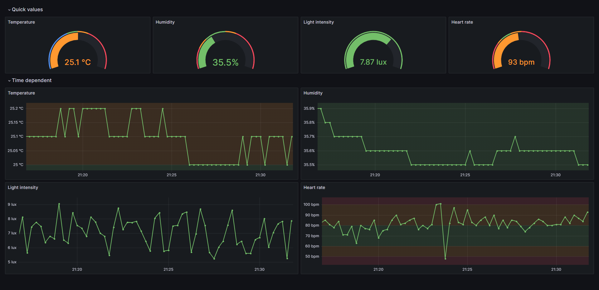

# Sensor API

## API

| URI          | Data                                                                                                     |
| ------------ | -------------------------------------------------------------------------------------------------------- |
| /temp        | Temperature mesured by the AM2320 in °C                                                                  |
| /hum         | Relative humidity mesured by the AM2320 in %                                                             |
| /illuminance | Light intensity mesured by the TSL2561 in lux                                                            |
| /heartrate   | Heart rate mesured by the KYTO2800D in bpm                                                               |
| /metrics     | All data in [Prometheus exposition format](https://prometheus.io/docs/instrumenting/exposition_formats/) |

## Config

Most of the configurable values, like the GPIO pins, are located in `include/config.h`.

### WIFI

The WIFI SSID and password are stored in the `secrets.h` file in the `include/` directory.

You can rename the `secrets.h.example` to `secrets.h` and fill in your information.

## Grafana

You can import the Grafana dashboard from the `grafana-dashboard.json` file.

## Electrical components

- [DOIT ESP32 DevKit v1](https://aliexpress.com/item/1005005688016405.html)
- [AM2320](https://aliexpress.com/item/32950694681.html)
- [KYTO2800D](https://aliexpress.com/item/1005005244410482.html)
- 5.3kHz non-coded heart rate transmitter (like the [KYTO2800C](https://www.aliexpress.com/item/32830159930.html))
- Pushbutton (like the [DTS-61N-V](https://www.mouser.de/ProductDetail/Diptronics/DTS-61N-V?qs=gTYE2QTfZfTZTPABWXJbEQ%3D%3D))
- [TSL2561](https://www.aliexpress.com/item/1005003306448614.html)
- 2x 220 Ohm resistors (LEDs)
- 2x 2.2k Ohm resistors (AM2320) (only when the AM2320 doesn't already has them, like on a module)

## Circuit

